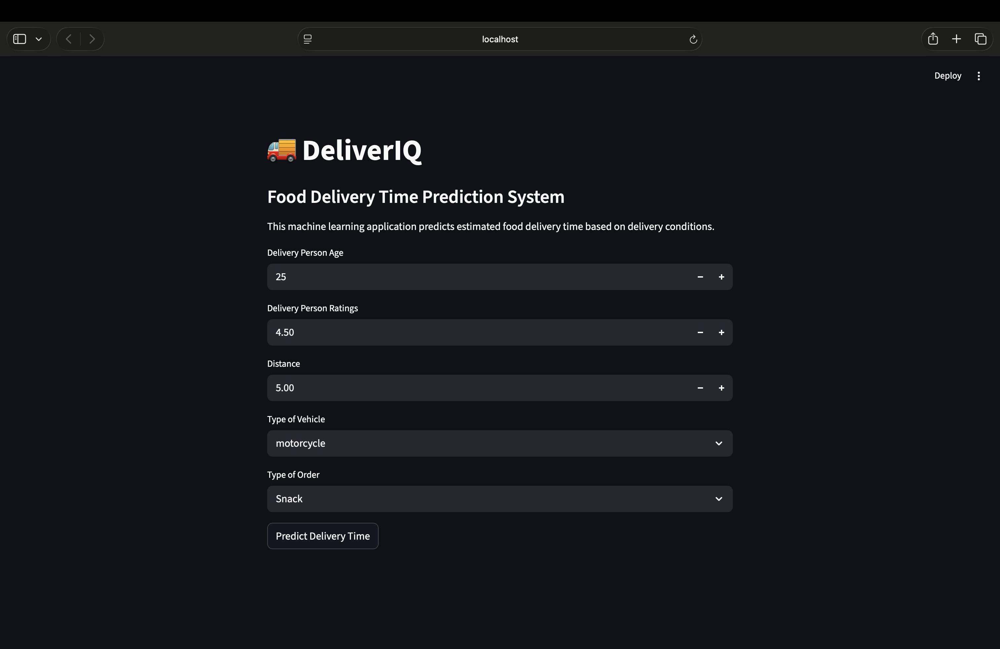
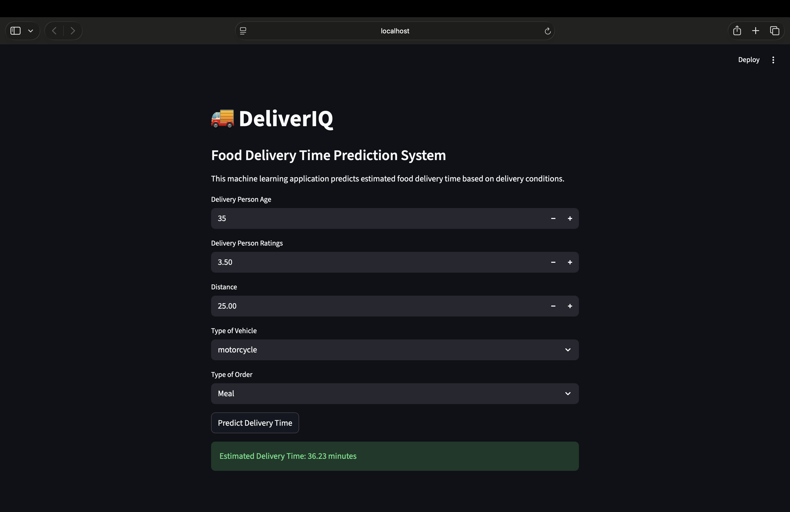
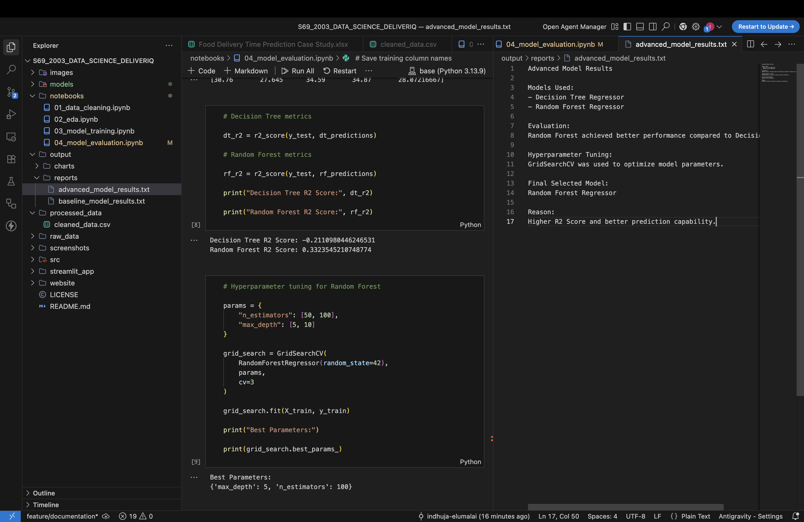

# 🚀 DeliverIQ — Food Delivery Time Prediction System

## 🌐 Live Deployments

### 📊 Data Analysis Website
https://deliveriq.netlify.app/

### 🤖 Machine Learning App
<your-streamlit-link>

---

# 📌 Project Overview

DeliverIQ is an end-to-end data science and machine learning project focused on analyzing and predicting food delivery delays.

The project combines:
- Exploratory Data Analysis (EDA)
- Data Cleaning & Feature Engineering
- Machine Learning Model Training
- Streamlit Deployment
- Interactive Web Visualization

The goal is to identify delivery delay patterns and build a predictive system capable of estimating food delivery time based on operational conditions.

---

# 🎯 Problem Statement

A food delivery platform wants to improve service reliability but lacks clarity on delivery time variations.

This project analyzes delivery data to identify delay patterns, operational inefficiencies, and delivery performance factors while also building a machine learning model capable of predicting delivery time.

---

# 📊 Dataset

- Source: Kaggle
- Records: 45,593
- Features:
  - Delivery Person Age
  - Delivery Person Ratings
  - Restaurant Coordinates
  - Delivery Location Coordinates
  - Vehicle Type
  - Order Type
  - Delivery Delay Time

---

# 🛠️ Tools & Technologies

## Data Analysis
- Python
- Pandas
- NumPy
- Matplotlib
- Seaborn

## Machine Learning
- Scikit-learn
- GridSearchCV
- Random Forest Regressor
- Decision Tree Regressor

## Deployment
- Streamlit
- Netlify

## Web Technologies
- HTML
- CSS
- JavaScript

## Version Control
- Git
- GitHub

---

# 🔄 Raw vs Cleaned Data

## 📥 Raw Dataset

The original dataset contained:
- Column name `Time_taken(min)` which was not intuitive
- No direct feature representing distance between restaurant and delivery location
- Data in original format without feature engineering

---

## 🧹 Cleaned Dataset

The dataset was transformed to improve clarity and analysis:

- Renamed column:
  - `Time_taken(min)` → `delivery_delay`
- Removed duplicate records
- Verified missing values
- Created a new feature:
  - **Distance** calculated using restaurant and delivery coordinates

---

## 🔍 Key Improvement

The addition of the **distance feature** enabled deeper analysis of delivery delays and significantly improved prediction capability for the machine learning models.

---

## 📊 Outcome

The cleaned dataset became:
- More readable
- Better structured
- Suitable for analysis
- Ready for machine learning workflows
- Optimized for visualization and deployment

---

# 🤖 Machine Learning Workflow

## 1️⃣ Data Preprocessing
- Missing value verification
- Feature engineering
- Encoding categorical columns
- Removing high-cardinality ID columns
- Train-test split

---

## 2️⃣ Baseline Model
- Linear Regression

Purpose:
- Establish initial prediction benchmark

---

## 3️⃣ Advanced Models
- Decision Tree Regressor
- Random Forest Regressor

Purpose:
- Improve prediction accuracy
- Compare model performance

---

## 4️⃣ Hyperparameter Tuning
- GridSearchCV optimization

Purpose:
- Identify best-performing model configuration

---

## 5️⃣ Model Deployment
- Streamlit web application
- Real-time prediction system
- Interactive user interface

---

# 📈 Analysis Performed

- Delivery Time Distribution
- Distance vs Delivery Time
- Vehicle Type Impact
- Order Type Impact
- Ratings vs Delivery Time
- Model Comparison Analysis

---

# 🔍 Key Insights

- Most deliveries are completed within **25–40 minutes**
- Delivery delay increases significantly with distance
- Vehicle type strongly affects delivery performance
- Higher-rated delivery personnel tend to deliver faster
- Extreme delays indicate operational inefficiencies
- Random Forest achieved superior prediction performance

---

# 📊 Model Evaluation

## Evaluation Metrics Used

- MAE (Mean Absolute Error)
- MSE (Mean Squared Error)
- RMSE (Root Mean Squared Error)
- R² Score

---

## 🏆 Best Performing Model

✅ Random Forest Regressor

### Reason
- Higher prediction accuracy
- Better generalization capability
- Improved R² score
- More stable predictions

---

# 🌐 Website

An interactive data visualization website was created to present delivery insights using dynamic charts and modern UI components.

### Project Name
✅ DeliverIQ

### Features
- Interactive charts
- Insight-driven storytelling
- Modern responsive UI
- Delivery performance analysis

---

# 🤖 Streamlit Prediction Application

The ML application allows users to:
- Enter delivery conditions
- Predict estimated delivery time
- Interact with the trained machine learning model in real time

---

## Application Features

- Interactive UI
- Real-time predictions
- Model integration using Pickle
- Deployment-ready architecture
- Dynamic feature handling

---

# 🖼️ Project Screenshots

## Home Page


---

## Prediction Output


---

## Model Evaluation


---

## 📂 Project Structure

```bash
S69_2003_DATA_SCIENCE_DELIVERIQ/
│
├── raw_data/
│   └── Food Delivery Time Prediction Case Study.xlsx
│
├── processed_data/
│   └── cleaned_data.csv
│
├── notebooks/
│   ├── 01_data_cleaning.ipynb
│   ├── 02_eda.ipynb
│   ├── 03_model_training.ipynb
│   └── 04_model_evaluation.ipynb
│
├── models/
│   ├── delivery_time_model.pkl
│   └── model_columns.pkl
│
├── output/
│   └── reports/
│       ├── baseline_model_results.txt
│       └── advanced_model_results.txt
│
├── screenshots/
│   ├── home_page.png
│   ├── prediction_output.png
│   └── model_evaluation.png
│
├── streamlit_app/
│   ├── app.py
│   └── requirements.txt
│
├── website/
│   └── index.html
│
├── images/
│   ├── dist.png
│   ├── distance.png
│   ├── order.png
│   ├── ratings.png
│   └── vehicle.png
│
├── README.md
├── requirements.txt
├── .gitignore
└── LICENSE
```
---

# 🚀 How to Run
### 1️⃣ Clone Repository
git clone <your-repository-link>
### 2️⃣ Install Dependencies
pip install -r requirements.txt
### 3️⃣ Run Streamlit Application
cd streamlit_app

streamlit run app.py
### 4️⃣ Open Analysis Website

Open:

website/index.html

---


# ⚠️ Limitations
- Dataset does not include traffic conditions
- Weather conditions are unavailable
- No real-time GPS tracking data
- Distance calculation is approximate
- Limited operational context variables

---


# 🔮 Future Improvements
- Live traffic integration
- Weather API integration
- Real-time delivery tracking
- Deep learning models
- Cloud deployment optimization
- Mobile application integration

---


# 🎯 Conclusion

DeliverIQ successfully combines data analysis and machine learning to understand and predict food delivery delays.

## The project demonstrates:

- Real-world data preprocessing
- Exploratory Data Analysis
- Feature engineering
- Predictive modeling
- Model evaluation
- Streamlit deployment
- Interactive insight communication

Random Forest Regressor achieved the best performance for predicting delivery delays.

## 👨‍💻 Technologies Used Summary
- Category	Technologies
- Data Analysis	Pandas, NumPy, Matplotlib, Seaborn
- Machine Learning	Scikit-learn
- Deployment	Streamlit, Netlify
- Web Development	HTML, CSS, JavaScript
- Version Control	Git, GitHub
---

# ✅ Final Project Status

- ✔️ Data Cleaning Completed
- ✔️ Feature Engineering Completed
- ✔️ Machine Learning Models Implemented
- ✔️ Hyperparameter Tuning Completed
- ✔️ Model Evaluation Completed
- ✔️ Pickle Model Saved
- ✔️ Streamlit Deployment Completed
- ✔️ Interactive Website Completed
- ✔️ Documentation Completed
- ✔️ Git Workflow Maintained